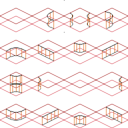
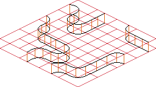
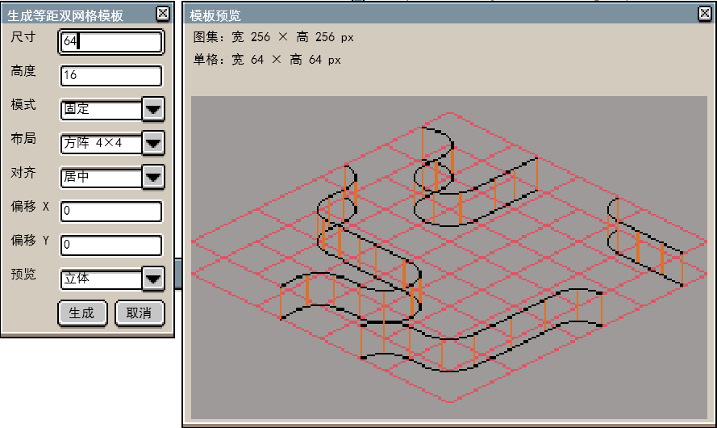
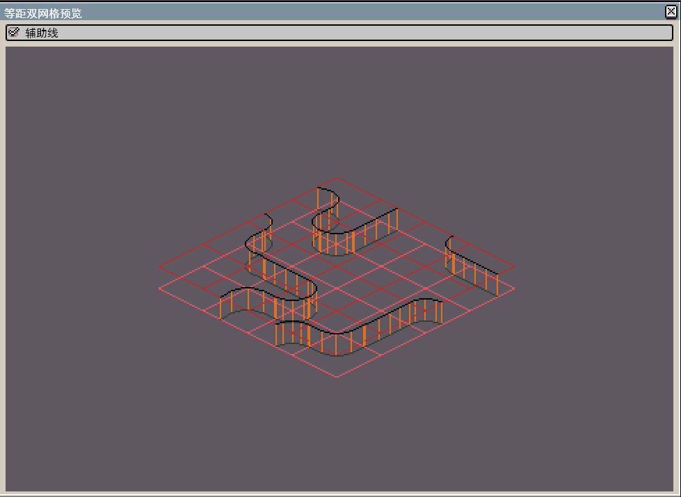
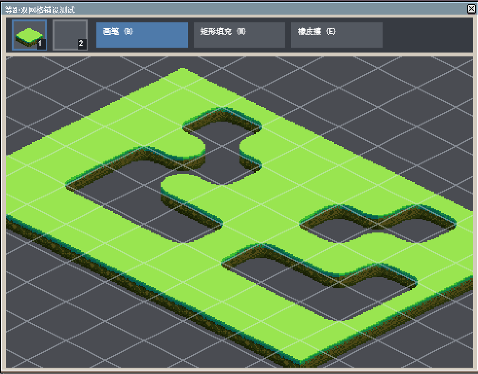

# Aseprite-Iso-DualGrid
     


### 这是什么？
- 这是一个 `Aseprite` 扩展插件，用于**生成等视距双网格模板**并提供**预览**

> 图块集 H:256px W:256px
> 

> 预览图
> 


### 如何使用？
- 从 [Release](https://github.com/Suzuran28/Aseprite-Iso-DualGrid/releases) 中下载以`.aseprite-extension`结尾的文件
- 打开`Aseprite`，编辑 &rarr; 首选项 &rarr; 添加扩展 &rarr; 选择`Aseprite-Iso-DualGrid.aseprite-extension`文件 &rarr; 完成
- 文件 &rarr; 生成等距双网格模板... 

- 窗口 &rarr; 打开等距双网格预览
> 右键拖动画布/滚轮切换缩放
> 


- 窗口 &rarr; 打开等距双网格铺设测试
> 两个地形操作预览 `图块(1, 1)` 与 `图块(3, 3)` 图块（如图分别为草地和空白）
> 顶部工具：画笔 `B`、矩形填充 `M`、橡皮擦 `E`；再次选择当前工具或按 `Esc` 可取消选择。
> 滚轮缩放；未选中工具时右键拖动平移，选中工具时按住空格并用左键或右键拖动平移。
>


### 开发
- 克隆仓库
  ```bash
  git clone https://github.com/Suzuran28/Aseprite-Iso-DualGrid.git
  ```
- 测试
- - 在Windows上
  ```pwsh
  .\scripts\test.ps
  ```
- - 在Linux上
  ```bash
  .\scripts\test.sh
  ```
- 打包
- - 在Windows上
  ```pwsh
  .\scripts\package.ps
  ```
- - 在Linux上
  ```bash
  .\scripts\package.sh
  ```

Copyright (c) 2026 Suzuran28
