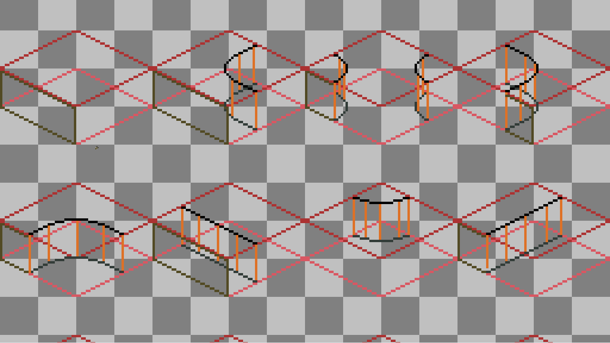

# Aseprite-Iso-DualGrid
     


### 这是什么？
- 这是一个 `Aseprite` 扩展插件，用于**生成等视距双网格模板**并提供**预览**

> 图块集 H:256px W:256px
> 

> 预览图
> 


### 安装
- 从 [Release](https://github.com/Suzuran28/Aseprite-Iso-DualGrid/releases) 中下载以`.aseprite-extension`结尾的文件
- 打开`Aseprite`，编辑 &rarr; 首选项 &rarr; 添加扩展 &rarr; 选择`Aseprite-Iso-DualGrid.aseprite-extension`文件 &rarr; 完成

### 特色与功能
- 文件 &rarr; 生成等距双网格模板... 

- 窗口 &rarr; 打开等距双网格预览
> 右键拖动画布/滚轮切换缩放
> 


- 窗口 &rarr; 打开等距双网格铺设测试
> 两个地形操作预览 `图块(1, 1)` 与 `图块(3, 3)` 图块（如图分别为草地和空白）
> 顶部工具：画笔 `B`、矩形填充 `M`、橡皮擦 `E`；再次选择当前工具或按 `Esc` 可取消选择。
> 滚轮缩放；未选中工具时右键拖动平移，选中工具时按住空格并用左键或右键拖动平移。
>


- 编辑 &rarr; 同面复制
> 为同一侧面提供绘制同步，只需绘制一面就能自动应用于拥有相同位置/相同掩码的图块
> 如果你对其实现感兴趣，不妨先看看[遮罩 *_mask.png](https://github.com/Suzuran28/Aseprite-Iso-DualGrid/tree/main/assets)
- - 不启用：关闭同面复制功能
- - 透明：专门用于绘制含有透明地形的图块集，如草地/水潭交界
- - 不透明：专门用于绘制拥有相同侧面的图块集，如草地/泥土，它们的侧面通常相同，仅在顶面有差异
- - 交错：专门用于绘制需要严格区分侧面的图块集，如草坪/公路，它们的侧面通常不同且存在明确的分界线


### 开发
- 克隆仓库
  ```bash
  git clone https://github.com/Suzuran28/Aseprite-Iso-DualGrid.git
  ```
- 测试
- - 在Windows上
  ```pwsh
  .\scripts\test.ps
  ```
- - 在Linux上
  ```bash
  .\scripts\test.sh
  ```
- 打包
- - 在Windows上
  ```pwsh
  .\scripts\package.ps
  ```
- - 在Linux上
  ```bash
  .\scripts\package.sh
  ```

Copyright (c) 2026 Suzuran28
